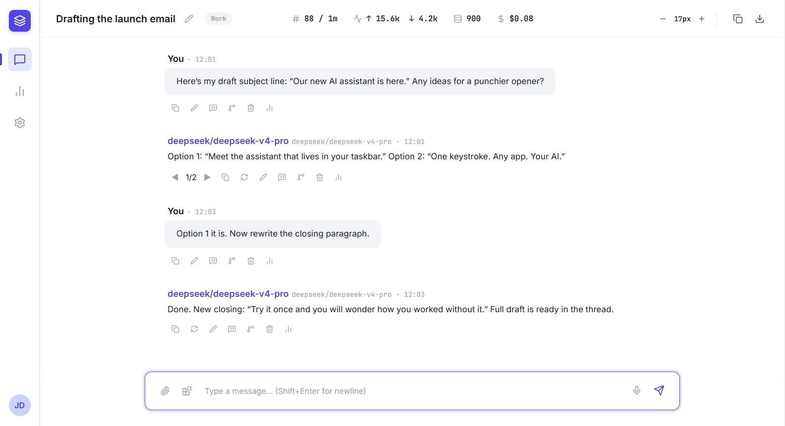
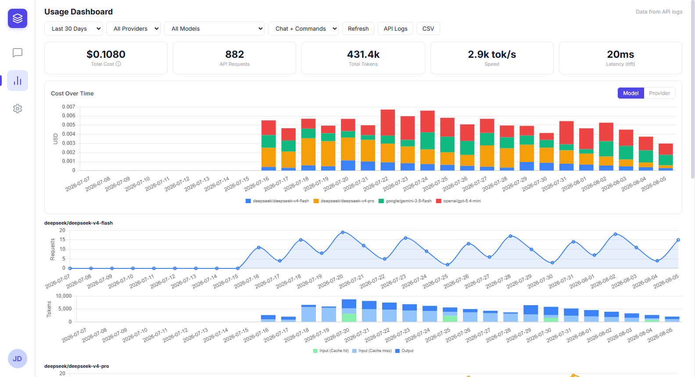
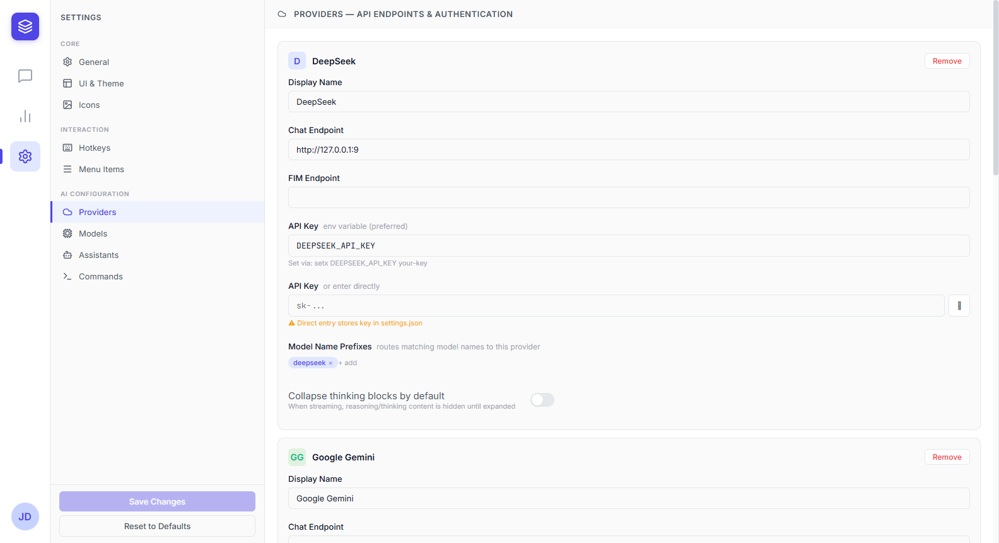

<h1 align="center">AhkLLM</h1>

<p align="center">
  <a href="#requirements"></a>
  <a href="https://www.autohotkey.com/"></a>
  <a href="LICENSE"></a>
</p>

<p align="center"><b>The AI assistant that's one keystroke away on Windows.</b></p>

Select text in any app, press `` ` ``, and pick from a menu of commands. Explain a diff, translate a paragraph, rewrite an email, or keep typing and let AhkLLM pick up where you left off. You can also just open the chat window and talk. You never leave the app you're in.

AhkLLM runs natively on Windows via AutoHotkey v2 with a WebView2 chat UI. It sits quietly in your system tray and preloads the chat window in the background, so it's ready the instant you hit the key.

<p align="center">
  
  
  
</p>

<p align="center"><em>Chat, the usage dashboard, and provider settings.</em></p>

## What you get

- **A command menu you can shape.** Each command is a small config entry with its own model, prompt, thinking level, and output mode. The defaults cover summarize, translate, explain, refine, rephrase in context, FIM fill and continue, and a screenshot command that sends your screen as image context. Add your own in `DefaultSettings.ahk` and it shows up in the menu, no code changes needed.
- **Rewrite or rephrase in place.** AhkLLM reads your selection through UI Automation, and when a command asks for it, the whole document around it. "Rephrase in Context" rewrites the highlighted text with the full page as context and drops the result back over the selection. You stay in the same app the whole time.
- **Keep typing, it takes over.** FIM Continue and FIM Fill use DeepSeek's FIM completion API (beta), which handles text and code alike. Put your cursor mid-line, trigger the command, and the model continues your sentence, your paragraph, or your function. No selection needed.
- **A real chat window.** Streaming responses, markdown with syntax highlighting and math rendering, edit, retry, quote, copy, and export.
- **Branching you can see.** Fork any message and explore alternate replies. Conversations render as an interactive tree, so you can hop between branches instead of scrolling a flat wall of text.
- **Drag in files.** Images, PDFs (scanned pages included), DOCX, and code, straight into the conversation.
- **Bring your own model.** DeepSeek, OpenAI, and Google Gemini out of the box, plus any OpenAI-compatible provider you add (OpenRouter, local servers, whatever has an API endpoint). Model selection is per conversation, per command, and per assistant.
- **Everything stays organized.** Folders, trash with auto-retention, real-time search across all your chats, assistant profiles with custom system prompts, and per-thread model, reasoning, and temperature settings.
- **Lock sensitive chats.** Protect any chat with a password: locked chats show a generic title + lock icon, are hidden from search, and refuse to load until unlocked. See [docs/locked-chats.md](docs/locked-chats.md) for exactly what the lock protects.
- **Know what it costs.** The usage dashboard charts tokens, spend, speed, and latency per model and provider, with filters and CSV export. A built-in API logs viewer lets you inspect requests and responses when something looks off.

## Requirements

- Windows 10 or later
- [AutoHotkey v2.0.18+](https://www.autohotkey.com/)
- [WebView2 Runtime](https://developer.microsoft.com/en-us/microsoft-edge/webview2/) (pre-installed on Windows 11)
- API keys for the providers you want to use, set as environment variables or entered directly in Settings:
  - `DEEPSEEK_API_KEY`
  - `OPENAI_API_KEY`
  - `GEMINI_API_KEY`

## Quick Start

1. Install [AutoHotkey v2](https://www.autohotkey.com/download/ahk-v2.exe)
2. Clone this repo
3. Set your API keys:
   ```cmd
   setx DEEPSEEK_API_KEY "sk-your-key"
   ```
4. Double-click `Main.ahk` (or run `AutoHotkey64.exe Main.ahk`)
5. Press `` ` `` to open the command menu
6. Press `` ` `` then `1` to open the chat window, or right-click the tray icon

## Configuration

Most settings live in the in-app Settings panel (gear icon in the chat window): providers, models, commands, assistants, hotkeys, theme, icons, and menu items. Add any OpenAI-compatible provider from the Providers tab, or refresh model metadata (pricing, capabilities) from the Models tab.

For power users, everything is also editable in [`default-settings/DefaultSettings.ahk`](default-settings/DefaultSettings.ahk). Save the file and the script auto-reloads (Ctrl+S).

Default hotkeys: `` ` `` (backtick) opens the command menu, Ctrl+Alt+R reloads the script, Ctrl+W closes pop-ups, and CapsLock+`` ` `` suspends and resumes. All of them are remappable.

## Where your data lives

Chats, settings, and attachments are stored locally under `%APPDATA%\AhkLLM\`: `settings.json`, a SQLite chat database with real-time search, and your uploaded files. The only thing leaving your machine is the request you send to the provider you picked.

Chat passwords are stored as PBKDF2-SHA-256 hashes and gate access inside the app; chat content itself is **not encrypted at rest** (see [Locked Chats](docs/locked-chats.md)).

## Running Tests

```cmd
# Unit + integration tests (AHK + JS)
tests\run_all_tests.bat

# Or individually:
tests\run_js_tests.bat    # Node.js unit tests (requires Node.js)
tests\run_ahk_tests.ahk   # AHK unit & integration tests

# Headless end-to-end GUI suite (launches the real app; needs an interactive session)
node tests\headless\e2e-suite.js --all
```

The headless harness manual is `tests/headless/README.md`; the live bug report is `tests/headless/BUG_HUNT_REPORT.md`.

## Architecture

See [`ARCHITECTURE.md`](ARCHITECTURE.md) for a deep dive into the data model, IPC, WebView communication, and module dependency graph.

## License

GNU General Public License v3.0. See [`LICENSE`](LICENSE).

AhkLLM is a derivative of [LLM-AutoHotkey-Assistant](https://github.com/kdalanon/LLM-AutoHotkey-Assistant) by [kdalanon](https://github.com/kdalanon), extended with a full WebView2 chat GUI, message branching, multi-provider streaming, file attachments, and a comprehensive test suite.
