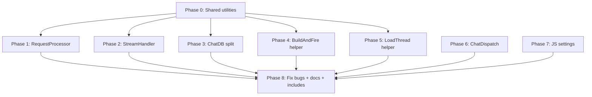

# Full Refactor Plan — ai-automation

## Deep Audit Findings

### Dead / Broken Code
| # | Location | Issue |
|---|----------|-------|
| 1 | [`app/ModelTracker.ahk:17,45`](ai-automation/app/ModelTracker.ahk:17) | `reloadScript` flag is set to `true` but NEVER read. The "auto-reload after all response windows close" feature (promised by MsgBox at [`Main.ahk:41-43`](ai-automation/Main.ahk:41)) is **broken** — `Reload()` is never called when `responseWindowLoadingCount` reaches 0. |
| 2 | [`chat/ChatCallbacks_Branch.ahk:55`](ai-automation/chat/ChatCallbacks_Branch.ahk:55) | `buttonClickAction()` uses a `switch` with only one case (`"Retry"`). Unnecessary dispatch pattern — replace with direct call. |

### LLM Artifacts / Documentation Drift
| # | Location | Issue |
|---|----------|-------|
| 3 | [`ARCHITECTURE.md:33,99,101,345`](ai-automation/ARCHITECTURE.md:33) | References `LLMClient.ahk` 4 times — file was renamed to [`LLMRequestBuilder.ahk`](ai-automation/api/LLMRequestBuilder.ahk:1). Also `LLMClient.test.ahk` should be `LLMRequestBuilder.test.ahk`. |
| 4 | [`ARCHITECTURE.md:310`](ai-automation/ARCHITECTURE.md:310) | Claims "No files exceed 300 lines" — outdated; 5 files exceed this. |

### Naming Inconsistencies
| # | Location | Issue |
|---|----------|-------|
| 5 | [`chat/ChatWindow.ahk:84,86`](ai-automation/chat/ChatWindow.ahk:84) | WebView instance named `responseWindow` + aliased as `chatWindow` — legacy from old multi-window model. |
| 6 | [`app/ModelTracker.ahk:15`](ai-automation/app/ModelTracker.ahk:15) | Function named `responseWindowState()` but handles both old "response windows" and new ChatWindow loading. |
| 7 | [`app/ModelTracker.ahk:16`](ai-automation/app/ModelTracker.ahk:16) | `responseWindowLoadingCount` — misleading since there's only one ChatWindow now. Rename to `loadingRequestCount`. |
| 8 | [`ui/CustomMessages.ahk:7-8`](ai-automation/ui/CustomMessages.ahk:7) | `WM_RESPONSE_WINDOW_LOADING_START/FINISH` — should be `WM_LOADING_START/FINISH` (no "response window" concept anymore). |
| 9 | [`chat/ChatUtils.ahk:46-49`](ai-automation/chat/ChatUtils.ahk:46) | `startLoadingCursor()` calls `notifyResponseWindowState()` — function name mismatch. |
| 10 | Request params | `requestParams["responseWindowTitle"]` used in StreamHandler — should be `chatWindowTitle` or just `windowTitle`. |

---

## Problem Summary

The codebase has grown organically and several files exceed reasonable size limits: [`chat/ChatDB.ahk`](ai-automation/chat/ChatDB.ahk:1) (750 lines), [`chat/StreamHandler.ahk`](ai-automation/chat/StreamHandler.ahk:1) (510 lines), [`webui/js/main.js`](ai-automation/webui/js/main.js:1) (439 lines), [`app/RequestProcessor.ahk`](ai-automation/app/RequestProcessor.ahk:1) (335 lines), and [`chat/ChatWindow.ahk`](ai-automation/chat/ChatWindow.ahk:1) (217 lines). Additionally, there are significant code duplication patterns and functions doing too many things.

**Note**: [`UserConfig.ahk`](ai-automation/UserConfig.ahk:1) (689 lines) is intentionally monolithic — it's the single user-facing config file. NOT part of this refactor.

---

## Duplication Analysis

### Dup 1: Provider/Model Name Parsing — 13+ locations across 8 files
Pattern: `slashPos := InStr(id, "/")` then `SubStr(id, 1, slashPos-1)` + `SubStr(id, slashPos+1)`

Affected: [`ProviderResolver.ahk:14`](ai-automation/api/ProviderResolver.ahk:14), [`CostCalculator.ahk:32`](ai-automation/api/CostCalculator.ahk:32), [`LLMRequestBuilder.ahk:73`](ai-automation/api/LLMRequestBuilder.ahk:73), [`ChatDB.ahk:293,671,689`](ai-automation/chat/ChatDB.ahk:293), [`ChatSettings.ahk:70,108,140,188`](ai-automation/chat/ChatSettings.ahk:70), [`ChatRequestBuilder.ahk:62`](ai-automation/chat/ChatRequestBuilder.ahk:62), [`ChatUtils.ahk:133`](ai-automation/chat/ChatUtils.ahk:133), [`StreamHandler.ahk:113,131,405,422`](ai-automation/chat/StreamHandler.ahk:113), [`RequestProcessor.ahk:154`](ai-automation/app/RequestProcessor.ahk:154)

### Dup 2: "Build-and-Fire" Pattern — 5 locations
`BuildAndWriteRequestFiles() -> check empty -> setChatButtonsEnabled(false) -> startLoadingCursor(true) -> sendRequestToLLM()`

Affected: [`ChatIPC.ahk:34,66`](ai-automation/chat/ChatIPC.ahk:34), [`ChatCallbacks_Message.ahk:45`](ai-automation/chat/ChatCallbacks_Message.ahk:45), [`ChatCallbacks_Branch.ahk:104`](ai-automation/chat/ChatCallbacks_Branch.ahk:104), [`ChatCallbacks_Edit.ahk:50`](ai-automation/chat/ChatCallbacks_Edit.ahk:50)

### Dup 3: Token Estimation (`StrLen(s) / 4`) — 4 locations
Affected: [`ChatDB.ahk:358,379,724`](ai-automation/chat/ChatDB.ahk:358), [`StreamHandler.ahk:236`](ai-automation/chat/StreamHandler.ahk:236)

### Dup 4: Thread Load + Refresh Pattern — 3 locations
`activeThreadId := threadId -> _restoreThreadSettings -> Msg_GetActivePath -> postWebMessage("initChatMode") -> postWebMessage("renderChatTree") -> postThreadStats -> _sendDropdownLabel`

Affected: [`ChatCallbacks_Sidebar.ahk:22,33`](ai-automation/chat/ChatCallbacks_Sidebar.ahk:22), [`ChatIPC.ahk:54`](ai-automation/chat/ChatIPC.ahk:54)

### Dup 5: Cost Calculation Duplication
[`ChatDB.ahk:281-313`](ai-automation/chat/ChatDB.ahk:281) (Msg_Insert) duplicates pricing lookup + math from [`CostCalculator.ahk:12-77`](ai-automation/api/CostCalculator.ahk:12)

### Dup 6: `debugLog()` — 2 implementations
[`RequestProcessor.ahk:9`](ai-automation/app/RequestProcessor.ahk:9) vs [`ChatUtils.ahk:69`](ai-automation/chat/ChatUtils.ahk:69)

### Dup 7: Model Name Sanitization — 4 times in StreamHandler.ahk
`StrReplace(SubStr(model, InStr(model, "/") + 1), ":", "-")` at lines 113, 131, 405, 422

### Dup 8: `readStreamChunk()` vs `_readStreamChunkFromParams()`
Two near-identical functions in [`StreamHandler.ahk`](ai-automation/chat/StreamHandler.ahk:1). `readStreamChunk()` is NOT dead — used by tests. Both should delegate to a shared pure function.

---

## Phases

### Phase 0: Extract Shared Utilities (MUST come first)

**0a: `lib/ModelId.ahk`** — Model ID parsing utility
```ahk
class ModelId {
    static Split(fullId)     ; returns {provider, name}
    static StripProvider(fullId)  ; returns name only
    static Sanitize(fullId)  ; strips provider + replaces ":" with "-"
}
```
Replaces 13+ inline parsing sites + 4 sanitization duplications.

**0b: `lib/TokenEstimation.ahk`** — Token estimation utility
```ahk
class TokenEstimation {
    static Estimate(str)     ; returns Round(StrLen(str)/4) with min 1
}
```
Replaces 4 inline estimation sites.

**0c: `lib/DebugLog.ahk`** — Shared debug logging
Replaces 2 duplicate `debugLog()` implementations.

### Phase 1: Break Up `app/RequestProcessor.ahk` (335 -> ~80 lines)

Split `processInitialRequest()` into:
- `app/ClipboardCapture.ahk` — text capture (FIM + non-FIM) (~130 lines)
- `app/InlineRequestRunner.ahk` — non-chat cURL execution + response handling (~120 lines)
- `app/RequestProcessor.ahk` — thin orchestrator (~80 lines)

### Phase 2: Reorganize `chat/StreamHandler.ahk` (510 -> ~180 lines)

- Remove duplication between `readStreamChunk()` and `_readStreamChunkFromParams()` — extract shared pure `_ReadStreamChunkInternal(state)` that both call
- Use `ModelId.Sanitize()` instead of 4 inline sanitizations
- Extract to `chat/StreamCompletionHandler.ahk`: `_handleStreamComplete()`, `saveStreamResponse()`, `_maybeGenerateTitle()`
- Extract to `chat/StreamErrorHandler.ahk`: `_handleStreamError()`, `_handleStreamCancelled()`, `_logCancelledRequest()`, `_getProviderEndpoint()`
- Keep `StreamHandler.ahk`: `sendStreamingRequest()`, `_pollStreamTimer()`, `_finalizeStreaming()`, `_cleanupStreamState()`

### Phase 3: Split `chat/ChatDB.ahk` (750 -> 3 files)

Extract to `chat/db/`:
- `ThreadRepo.ahk` — Thread CRUD (~200 lines)
- `MessageRepo.ahk` — Message CRUD + tree ops (~420 lines)
- `AssistantRepo.ahk` — Assistant CRUD (~50 lines)

Also: Replace inline cost calculation in `Msg_Insert` with `CostCalculator.ComputeTokenCosts()` call. Use `TokenEstimation.Estimate()` for all char/4 calculations.

### Phase 4: Extract `_BuildAndFireRequest()` Helper

Extract to [`chat/ChatRequestBuilder.ahk`](ai-automation/chat/ChatRequestBuilder.ahk:1):
```ahk
_BuildAndFireRequest() {
    chatHistoryJSONRequest := BuildAndWriteRequestFiles()
    if !chatHistoryJSONRequest {
        postWebMessage("setChatButtonsEnabled", true)
        startLoadingCursor(false)
        return false
    }
    postWebMessage("setChatButtonsEnabled", false)
    startLoadingCursor(true)
    sendRequestToLLM(&chatHistoryJSONRequest)
    return true
}
```
Replaces 5 duplicate call sites.

### Phase 5: Extract `_LoadThreadAndRefreshUI()` Helper

Extract to [`chat/ChatUtils.ahk`](ai-automation/chat/ChatUtils.ahk:1):
```ahk
_LoadThreadAndRefreshUI(threadId, includeDropdownLabel := true) {
    activeThreadId := threadId
    _restoreThreadSettings(activeThreadId)
    path := ChatDB.Msg_GetActivePath(activeThreadId)
    postWebMessage("initChatMode", buildStructuredMessagesFromPath(path))
    postWebMessage("renderChatTree", ChatDB.Msg_GetTree(activeThreadId))
    postThreadStats(activeThreadId)
    if includeDropdownLabel
        _sendDropdownLabel()
}
```
Replaces 3 duplicate call sites.

### Phase 6: Extract `ChatWindow.ahk` Message Dispatch (217 -> ~180 lines)

- Move `OnWebMessageReceived` + callback includes to `chat/ChatDispatch.ahk`

### Phase 7: Extract Model Settings UI from `webui/js/main.js` (439 -> ~290 lines)

- Move model settings modal functions to `webui/js/chat-settings.js`
- Add script tag to `index.html`

### Phase 8: Fix Bugs, Naming, Docs, and Clean Up

**8a: Fix `reloadScript` — auto-reload on UserConfig save**

When the user edits [`UserConfig.ahk`](ai-automation/UserConfig.ahk:1) and presses Ctrl+S, the script should:
1. If no active requests: `Reload()` immediately (already works)
2. If active requests: wait for them to finish, then `Reload()`

Currently step 2 is broken — `reloadScript` is set to `true` but never checked. Fix in [`app/ModelTracker.ahk`](ai-automation/app/ModelTracker.ahk:45):
```
case "reloadScript": reloadScript := true

; In WM_RESPONSE_WINDOW_LOADING_FINISH case, after:
if (responseWindowLoadingCount = 0) {
    manageCursorAndToolTip("Reset")
    if reloadScript        ; <-- ADD THIS CHECK
        Reload()           ; <-- Reload() fires OnExit -> KillChatWindow -> respawns ChatWindow too
}
```

This handles both processes: `Reload()` kills the main script, `OnExit(KillChatWindow)` kills the ChatWindow subprocess, then Main.ahk restarts and spawns a fresh ChatWindow.

**8b: Fix All Naming Inconsistencies**

| Current Name | New Name | Files Affected |
|---|---|---|
| `responseWindow` variable | `chatWindow` directly (remove alias) | `ChatWindow.ahk`, `ChatUtils.ahk` |
| `responseWindowState()` function | `handleLoadingState()` | `ModelTracker.ahk`, `Main.ahk:170` |
| `responseWindowLoadingCount` | `loadingRequestCount` | `ModelTracker.ahk` |
| `WM_RESPONSE_WINDOW_LOADING_START` | `WM_LOADING_START` | `CustomMessages.ahk`, `ModelTracker.ahk`, `ChatUtils.ahk` |
| `WM_RESPONSE_WINDOW_LOADING_FINISH` | `WM_LOADING_FINISH` | `CustomMessages.ahk`, `ModelTracker.ahk`, `ChatUtils.ahk` |
| `notifyResponseWindowState()` | `notifyLoadingState()` | `CustomMessages.ahk`, called from `ChatUtils.ahk:46,49` and `ChatWindow.ahk:179,200` |
| `requestParams["responseWindowTitle"]` | `requestParams["windowTitle"]` | `ChatWindow.ahk:64`, `StreamHandler.ahk:217,338` |

Note: `responseWindowFontFace` in [`UserConfig.ahk`](ai-automation/UserConfig.ahk:1) stays — UserConfig is off limits.

**8c: Simplify `buttonClickAction`**
Replace `switch(action) { case "Retry": ... }` with direct `if (action = "Retry") { ... }` since there's only one case.

**8d: Fix ARCHITECTURE.md**
- Replace all `LLMClient.ahk` with `LLMRequestBuilder.ahk` (4 occurrences)
- Update file size claim (remove "No files exceed 300 lines")
- Update directory structure to reflect new files

**8e: Update All Includes and Script Tags**
- `lib/Config.ahk` — add new shared utility includes
- `chat/ChatWindow.ahk` — add `ChatDispatch.ahk`, update StreamHandler includes
- `chat/ChatDB.ahk` — add `db/*.ahk` includes
- `Main.ahk` — update module includes
- `tests/run_tests.ahk` — update includes for split modules
- `webui/index.html` — add `chat-settings.js` script tag

---

## Dependency Graph



---

## Expected Result

| File | Before | After | Key Change |
|------|--------|-------|------------|
| `app/RequestProcessor.ahk` | 335 | ~80 | Split into ClipboardCapture + InlineRequestRunner |
| `chat/StreamHandler.ahk` | 510 | ~180 | Dedup + extract error/completion handlers |
| `chat/ChatDB.ahk` | 750 | ~40 | Split into db/ThreadRepo + MessageRepo + AssistantRepo |
| `chat/ChatWindow.ahk` | 217 | ~180 | Extract ChatDispatch |
| `webui/js/main.js` | 439 | ~290 | Extract chat-settings.js |
| `chat/ChatRequestBuilder.ahk` | 143 | ~80 | Add _BuildAndFireRequest helper |

**New files**: 11 (`ModelId.ahk`, `TokenEstimation.ahk`, `DebugLog.ahk`, `ClipboardCapture.ahk`, `InlineRequestRunner.ahk`, `StreamCompletionHandler.ahk`, `StreamErrorHandler.ahk`, `ThreadRepo.ahk`, `MessageRepo.ahk`, `AssistantRepo.ahk`, `ChatDispatch.ahk`, `chat-settings.js`)

**Bugs fixed**: 1 (`reloadScript`) | **Docs fixed**: 1 (`ARCHITECTURE.md` stale refs)

---

## Files NOT Touched

- `UserConfig.ahk` (689 lines) — user-facing config, single-file UX is intentional
- All `api/` files except minor ModelId/TokenEstimation import additions
- `app/CommandMenu.ahk`, `app/CommandManager.ahk`, `app/ModelTracker.ahk` (except reloadScript fix), `app/UiHelpers.ahk`
- All `chat/ChatCallbacks_*.ahk` (except using new helpers)
- `chat/ChatIPC.ahk`, `chat/ChatSettings.ahk`, `chat/ChatUtils.ahk`
- `ui/CustomMessages.ahk`, `ui/InputWindow.ahk`
- All vendor libs
